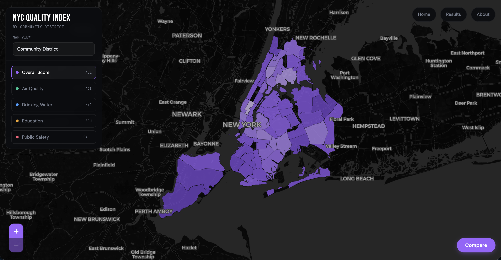
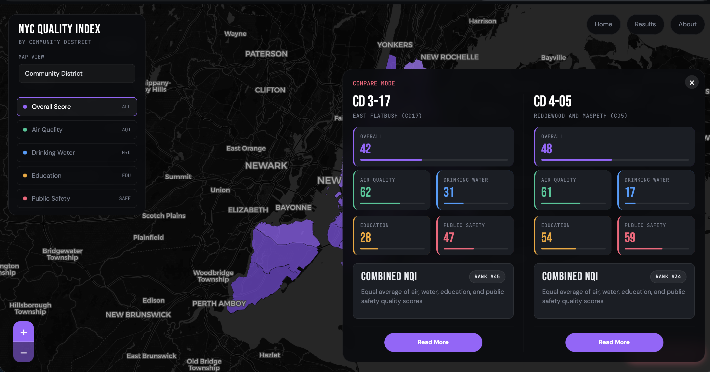
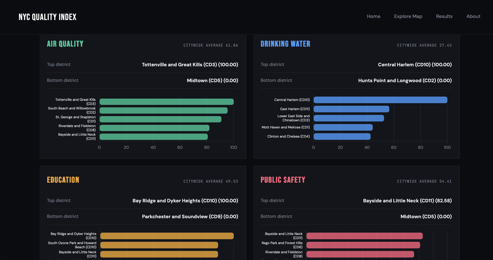
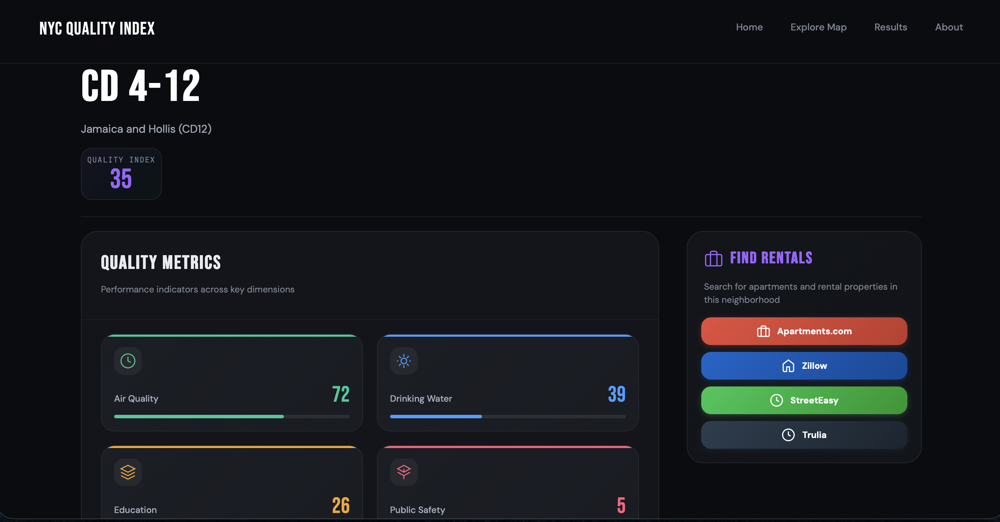

# NYC Neighborhood Quality Index

An interactive geospatial analytics platform for exploring neighborhood conditions across New York City using public datasets, GPU-accelerated processing, and dynamic spatial visualization.

The project combines environmental, education, and public safety datasets into a unified **Neighborhood Quality Index (NQI)** that allows users to compare NYC communities through interactive maps, rankings, dashboards, and district-level analysis tools.

Built as a senior design project focused on:

- geospatial data engineering
- GPU-accelerated analytics
- interactive visualization
- neighborhood-level spatial analysis

## Why This Project Exists

New York City provides large amounts of public data through different agencies, but those datasets are fragmented across incompatible geographic systems, inconsistent reporting formats, and unrelated measurement scales.

The goal of NYC Neighborhood Quality Index is to unify environmental, educational, and public safety indicators into a single neighborhood-level analytics platform that supports meaningful comparison across New York City communities.

Rather than requiring users to manually search across separate agency portals, the project transforms those datasets into one readable framework for exploration, ranking, and side-by-side neighborhood analysis.

## Features

- Interactive NYC choropleth map visualization
- Multiple geography views:
  - Community Districts
  - Boroughs
  - Neighborhood Tabulation Areas (NTAs)
  - ZIP Codes
- District comparison mode with side-by-side metrics
- Neighborhood detail pages with rankings and score breakdowns
- Results dashboard with category analysis and citywide rankings
- GPU-accelerated crime-data processing using RAPIDS cuDF and CuPy
- Area-weighted geographic score rollups across multiple NYC boundary systems
- Background cache warm-up for smoother geography switching after app startup
- Dynamic metric-based visualization for:
  - Air Quality
  - Drinking Water
  - Education
  - Public Safety

## Project Highlights

- Built a full-stack geospatial analytics application using Flask, GeoPandas, Leaflet, and Chart.js
- Unified multiple NYC Open Data datasets into a shared neighborhood-level scoring framework
- Processed and normalized heterogeneous datasets with different geographic structures and data formats
- Implemented GPU-accelerated processing pipelines using RAPIDS cuDF and CuPy
- Reduced large-scale crime pipeline runtime from approximately **2 minutes 13 seconds (CPU)** to **4-5 seconds (GPU)** on server hardware
- Designed an interactive frontend for neighborhood exploration, ranking analysis, and district comparison

## System Architecture

The platform consists of four major stages:

1. Data collection from NYC Open Data and agency sources
2. Data cleaning, transformation, and feature engineering
3. Geospatial aggregation and NQI score generation
4. Interactive visualization through Flask, Leaflet, and Chart.js

```text
NYC Open Data
      ↓
Processing Pipelines
      ↓
Score Generation
      ↓
NQI Aggregation
      ↓
Flask Backend
      ↓
Leaflet + Chart.js Frontend
```

## Screenshots

### Landing Page

The landing page introduces the platform and provides an immediate entry point into the interactive map experience.



### Interactive NYC Map

The map interface supports metric switching, multi-boundary geography views, and direct district exploration through a choropleth visualization.



### Compare Mode

Compare mode allows users to select two districts and review category scores, rank context, and overall NQI side by side.



### Results Dashboard

The dashboard provides chart-based analysis across all four scoring categories, highlighting leaders, lagging districts, and citywide distribution patterns.


### District Detail Page

District detail pages combine metric cards, contextual ranking information, and rental-platform links for practical neighborhood exploration.



## What The Neighborhood Quality Index Measures

The Neighborhood Quality Index combines four major categories into a unified scoring framework.

### Air Quality

Uses pollutant measurements including:

- PM2.5
- Nitrogen Dioxide (NO2)
- Ozone (O3)

Environmental indicators are normalized and aggregated into a composite AirScore.

### Drinking Water

Uses public water monitoring indicators including:

- chlorine residual
- turbidity
- fluoride concentration
- bacterial measurements

Sampling-site reconstruction and coordinate enrichment were used to integrate spatially-aware water quality analysis.

### Education

Uses district and school-level educational quality indicators transformed from qualitative DOE ratings into standardized numerical scores.

Examples include:

- WD (Well Developed)
- P (Proficient)
- D (Developing)
- U (Underdeveloped)

### Public Safety

Uses NYPD complaint data processed through weighted severity analysis.

Crime incidents were weighted using:

- offense severity
- legal classification
- attempted vs completed status

Higher SafetyScores represent lower overall crime burden.

## Neighborhood Quality Index (NQI)

The final Neighborhood Quality Index score is computed as the equal average of the four normalized category scores:

```text
NQI = (Air Quality + Water Quality + Education + Public Safety) / 4
```

All category scores are normalized into a standardized 0-100 range to allow comparison between datasets with different units and scales.

## Processing Pipeline

The system transforms fragmented NYC public datasets into a unified neighborhood-level analysis framework through a multi-stage processing pipeline.

```text
Raw NYC Open Data
        ↓
Data Cleaning & Validation
        ↓
Feature Transformation
        ↓
Geospatial Alignment
        ↓
Z-Score Normalization
        ↓
Composite Score Generation
        ↓
Interactive Visualization
```

The pipeline integrates:

- spatial joins
- coordinate reconstruction
- statistical normalization
- weighted aggregation
- GPU-accelerated dataframe operations
- dynamic frontend visualization

## Geospatial Processing

One of the primary challenges of the project was integrating datasets reported across incompatible geographic systems.

Examples included:

- UHF42 health districts
- police precincts
- water sampling locations
- school-level coordinate data

GeoPandas and GeoJSON boundary processing were used to align all datasets into a shared neighborhood framework supporting:

- Community Districts
- NTAs
- Boroughs
- ZIP Codes

The architecture was designed to support flexible geographic rollups and reusable spatial aggregation.

## GPU Acceleration

GPU acceleration was selectively applied to computationally intensive workflows using:

- RAPIDS cuDF
- CuPy
- CUDA-enabled processing

The largest performance gains occurred during processing of the NYPD complaints dataset containing millions of incident-level records.

GPU acceleration enabled:

- parallel aggregation
- weighted incident processing
- normalization
- large-scale dataframe operations

### Benchmark

| Processing Mode | Runtime |
| --- | --- |
| CPU Processing | ~2 minutes 13 seconds |
| GPU Processing | ~4-5 seconds |

This hybrid CPU/GPU design allowed the project to remain portable while scaling efficiently for large urban datasets.

## Tech Stack

### Backend & Processing

- Python
- Flask
- pandas
- GeoPandas
- NumPy
- RAPIDS cuDF
- CuPy

### Frontend

- HTML
- CSS
- JavaScript
- Leaflet
- Chart.js

### Geospatial & Visualization

- GeoJSON
- Spatial joins
- Choropleth rendering
- Interactive dashboards

## Repository Structure

```text
frontend/
│
├── app.py
├── templates/
└── static/

scripts/
│
├── air_quality_process.py
├── water_quality_process.py
├── education_quality_process.py
├── safety_quality_process.py
├── safety_cd_aggregate.py
└── build_combined_cd_scores.py

data/
│
├── 2005_-_2020_Quality_Review_Ratings_20260218.csv
├── Air_Quality_20260217.csv
├── Drinking_Water_Quality_Distribution_Monitoring_Data_20260218.csv
├── water_sampling_sites.csv
└── geographies/

outputs/
│
└── combined_nqi_cd_table.csv
```

## Running The Project

### Clone the Repository

```bash
git clone <repo-url>
cd nyc-neighborhood-quality-index
```

### Install Dependencies

```bash
pip install -r requirements.txt
```

### Run the Application

```bash
python frontend/app.py
```

Open:

```text
http://127.0.0.1:5000
```

## Data Sources

The project integrates public datasets from:

- NYC Open Data
- NYC Department of Environmental Protection
- NYC Department of Education
- NYPD Complaint Data
- NYC Air Quality datasets
- NYC geographic boundary datasets

## Data Coverage Note

This project combines datasets with different reporting windows and refresh cadences. For example, the current education source spans **2005-2020**, while other datasets reflect different collection periods.

The project should therefore be understood as a neighborhood analytics and scoring prototype built on available public data rather than a live real-time conditions platform.

## Technical Challenges

### Geographic Alignment

Datasets were reported using incompatible systems including:

- UHF42 health districts
- NYPD precincts
- water sampling locations
- school-level coordinates

A major challenge was transforming all datasets into a common neighborhood framework.

### Large-Scale Crime Processing

The NYPD complaints dataset contained millions of records.

GPU acceleration using RAPIDS cuDF and CuPy reduced processing time from approximately 2 minutes 13 seconds to 4-5 seconds.

### Data Standardization

The project integrated:

- numerical measurements
- categorical ratings
- geospatial data
- environmental indicators

Each required custom preprocessing before score generation and normalization into a comparable 0-100 framework.

## Documentation

Additional project documentation:

- [Final Report](docs/final-report.pdf)
- [Senior Design Presentation](docs/presentation.pdf)

## Future Improvements

- Improve installation and deployment workflow
- Add loading states during geography switching
- Add automated tests for APIs and score pipelines
- Add historical trend analysis
- Add filtering and advanced search tools
- Deploy the application publicly
- Add real-time or scheduled dataset refreshes
- Expand neighborhood recommendation functionality

## Skills Demonstrated

- Python
- Flask
- GeoPandas
- RAPIDS cuDF / CuPy
- geospatial analysis
- data engineering
- statistical normalization
- interactive data visualization

## Project Status

Completed senior design project demonstrating geospatial analytics, public-data integration, GPU-accelerated processing, and interactive neighborhood visualization across New York City.
